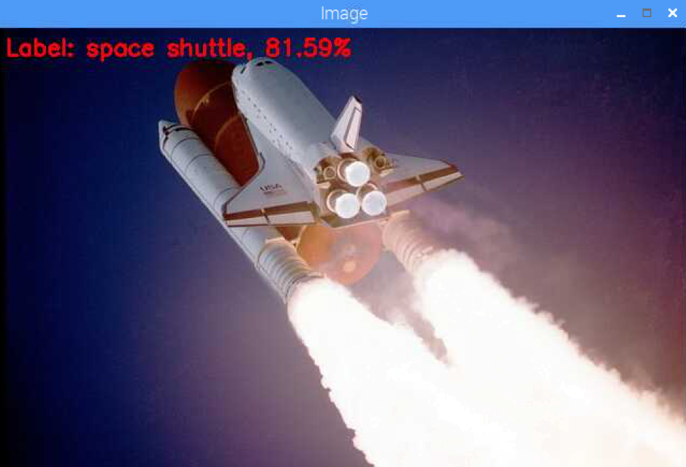

# Raspberry Pi 3 Image Classification

## Installation
- Raspbian Stretch Desktop https://www.raspberrypi.org/documentation/installation/installing-images/linux.md
- OpenCV 3.3.0 https://www.pyimagesearch.com/2017/10/09/optimizing-opencv-on-the-raspberry-pi

## Deep Learning Networks for Image Classification on Raspberry Pi 3
### GoogleNet  

### SqueezeNet

